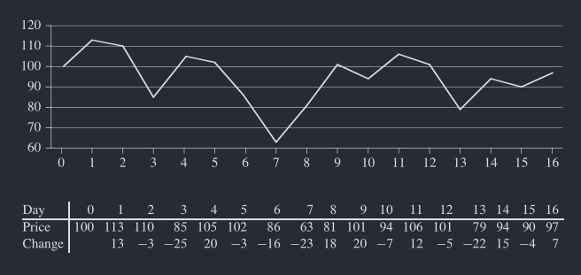
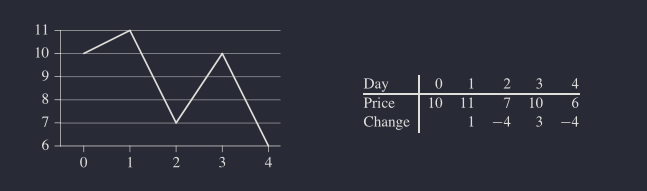
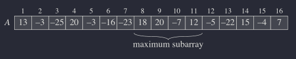
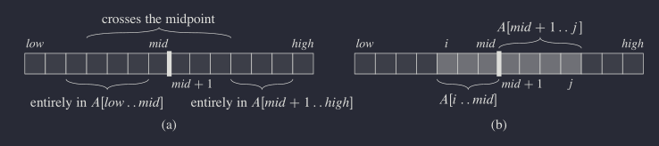

\usepackage[utf8] 
\usepackage{amsmath, amsfofntts, amstthm, graphicx, geometry, lipsum}

<h1>The maximum-subarray problem</h1>

Suppose that you been offered the opportunity to invest in the Volatile Chemical Corp. 
Like the chemicals company procedures, the stock price of the Volatile Chemical Corp 
is rather volatile. You are allowed to buy one unit of stock one time and then sell it 
later date, buying and selling after the close of trading for the day. To compensate 
for this restriction, you are allowed to learn what the price of the stock will be in 
the future. The goal is to maximize your profit. The following image shows the price 
of the stock over a 17-day period. You may buy the stock at any one time, starting after
day 0, when the price is $100 per share. Of couse, you would want to "buy low, sell high"-
buy at the lowest possible price within a given period. In the figure the lowest price 
occurs after day 7, which occurs after the highest price, after day 1. 

You might think that you can always maximize profit by either buying at the lowest price
or selling at the highest price. For example in the Figure, we would maximize profit by 
buying at the lowest price, after day 7. If this strategy always worked, then it would be 
easy to determine how to maximize profit: find the highest and lowest prices, and then work 
left from the highest price to find the lowest prior price, work right from the lowest price 
to find the highest later price, and take the pair with the greater difference.

Figure:

<em>The 2nd picture serves as example that the maximum profit does not always start at the 
lowest price or end at the highest price. Again, the horizontal axis indicates the day, 
and the vertical axis shows the price. Here the maximum profit of $3 per share would be 
earned by buying after day 2 is not the lowest price overall, and the price of $10 after 
day 3 is not the highest overall.</em>

Demonstrating that the maximum profit sometimes comes neither by buying at the lowest price 
nor by selling at the highest price. 

<h2>A brute-force solution</h2>

We can easily devise a brute-force solution to this problem: just try every possible pair of 
buy and sell dates in which the buy date precedes the sell date. A period of $n$ days has 
$\binom{n}{2}$ such pair of dates. <em>Check pascal triangle</em>

Since $\binom{n}{2}$ is $\Theta(n^2)$, and the best hope for is to evaluate each pair of dates 
in constant time, this approach would take $\Omega(n^2)$ time. 

<h2>A transformation</h2>

In order to design an algorithm with an $o(n^2)$ running time, we will look at the input in a 
slightly different way. We want to find a sequence of days over which net change from the first 
day to the last is maximum. Instead of looking at the daily prices, let us instead consider the 
daily change in price, where the change on day $i$ is the difference between the prices after 
day $i - 1$ and after day $i$. The table in the previous Figure shows these daily changes in the 
bottom row. If we treat this row as an array $A$, shown in the next Figure, we now want to find 
the nonempty, contigious subarray of $A$ whose values have the largest sum. We call this contigious 
subarray the <em>maximum subarray</em>. For example in the array shown in next figure, the maximum subarray 
of $A[1..16]$ is $A[8..11]$, with the sum 43. Thus, you would want to buy the stock just before day 8 
and sell it after day 11, earning a profit of $43 per share. 

At first glance, this transformation does not help. We still need to check $\binom{n-1}{2} = \Theta(n^2)$ 
subarrays for a period of $n$ days.

To find a more efficient solution to the maximum-subarray problem. When doing so, we will usually speak of 
"a" maximum-subarray rather "the" maximum-subarray, since there could be a more than one subarray that achieves
the maximum sum.

<h3>Using divide-and-conquer</h3>

If we want to find a maximum maximum-subarray of the subarray $A[low..high]$, we could divide the subarray into 
two subarrays of as equal size as possible. 

1) Find the midpoint $mid$ of the subarray, and consider $A[low..mid]$ and $A[mid + 1..high] so that: 
    Any contigious subarray $A[i..j]$ of $A[low..high]$ must lie in:
      - entirely in the subarray $A[low..mid]$, that $low &lt;= i &lt;= j &lt;= mid$
      - entirely in the subarray $A[mid + 1..high]$ that $mid &lt; i &lt;= j &lt;= high$ 
      - crossing the the midpoint, so that $low &lt;= i &lt;= mid &lt;= j &lt;= high$ 

Therefore, a maximum subarray of $A[low..high]$ must lie in exacttly one of these places. In fact, 
a maximum-subarray of $A[low..high]$ must have the greatest sum over all subarrays entirely in $A[low..mid]$,
entirely in $A[mid + 1..high]$, or crossing the midpoint. We can find maximum subarrays of $A[low..mid]$ and 
$A[mid + 1..high]$ recursively, because tthese two subproblems are smaller instances of the problem of finding 
a maximum-subarray. What is left to do is to find a maximum-subarray that crosses the midpoint, and take a 
subarray with the largest sum of the three. 

Possible locations of subarrays $A[low..high]$ entirely in $A[low..mid]$, entirely in $A[mid + 1, high]$, 
or crossing the midpoint $mid$. Any subarray of $A[low..high]$ crossing the midpoint comprises two subarrays 
$A[i..mid]$ and $A[mid + 1..j]$, where $low &lt;= i &lt;= mid$ and $mid &lt; j &lt;= high$ 

We can easily find a maximum subarray crossing the midpoint in time linear of the size of the subarray 
$A[low..high]$. This problem is <em>not</em> a smaller instance of our original problem, because it has added restriction 
that the subarray it chooses must cross the midpoint. 

The procedure <strong>Find-Max-Crossing-Subarray</strong> takes as input the array $A$ and the indices $low, mid$ and $high$, 
and it returns a tuple containing the indices demarcatting a maximum subarray  that crosses the midpoint, 
along with the sum of the values in a maximum subarray. 

<strong>Check implementation in source Python-CPP files</strong> 
